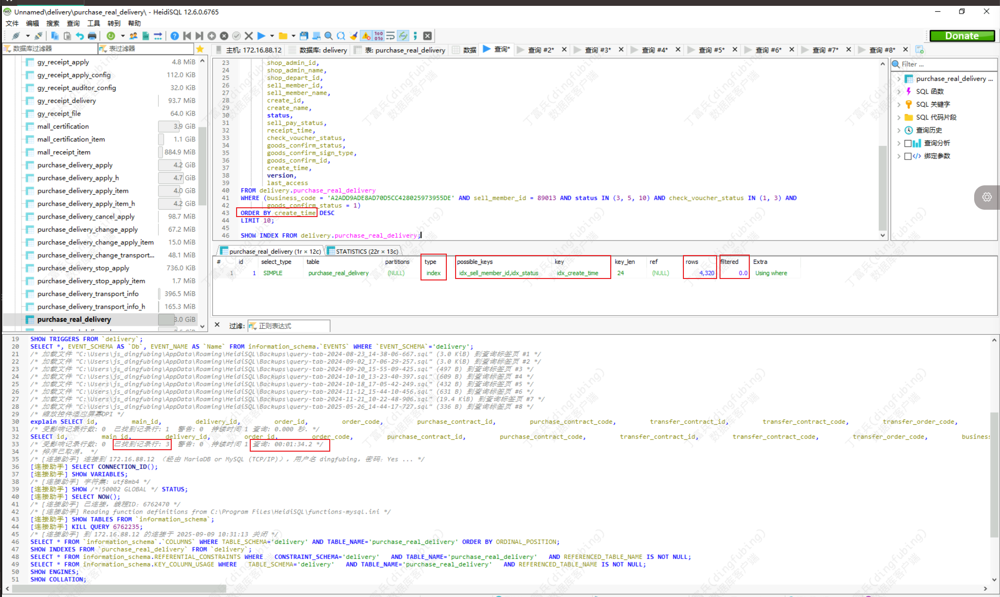
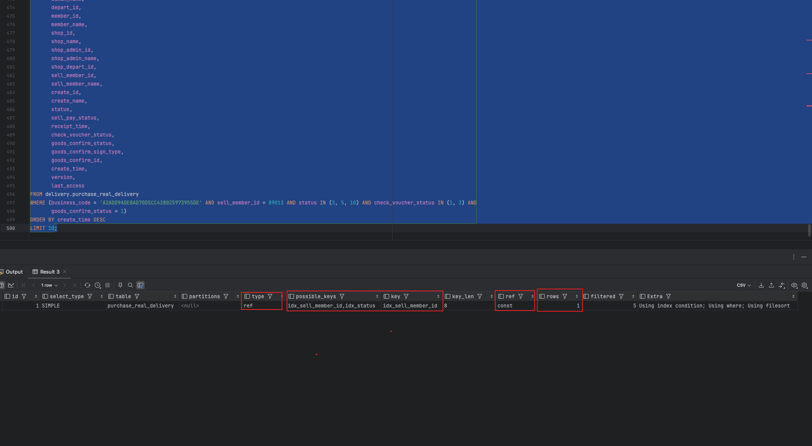
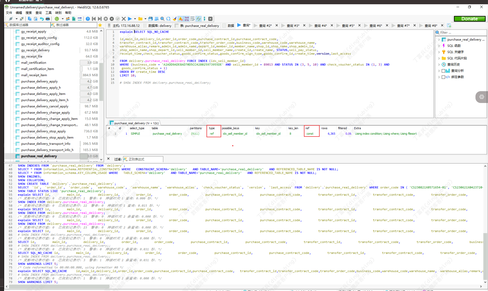

# 生产环境慢 SQL：优化器选错索引排查复盘

这篇文章记录一次生产环境查询超时问题。它不是典型的“没加索引导致慢”，而是更容易被忽略的一类问题：

```text
表结构和索引一样，SQL 一样，数据量差异不大，但生产环境和预发环境选择了不同索引。
```

最终根因不是 SQL 逻辑复杂，而是 MySQL 优化器基于统计信息和成本模型选择了不合适的索引，导致普通单表分页查询在生产环境耗时约 93 秒。

## 场景

在一次排查异常日志时，发现数据库连接超时日志。最开始看到的是连接超时现象，但应用其他功能正常，数据库整体状态也正常，所以问题不像是数据库整体不可用，更像是某条 SQL 或某个业务入口触发了异常慢查询。



通过日志、代码和 SkyWalking 还原出最终 SQL：

```sql
SELECT *
FROM delivery.purchase_real_delivery
WHERE (
    business_code = 'A2ADD9ADE8AD70D5CC428025973955DE'
    AND sell_member_id = 89013
    AND status IN (3, 5, 10)
    AND check_voucher_status IN (1, 3)
    AND goods_confirm_status = 1
)
ORDER BY create_time DESC
LIMIT 10;
```

这是一条普通单表分页查询：

- 多个等值条件；
- 两个 `IN` 条件；
- 按 `create_time` 倒序；
- 只取前 10 条。

从 SQL 形态看，它不应该慢到连接超时。

## 当时的排查路径

### 1. 先确认是不是数据库整体问题

第一反应不是直接改 SQL，而是先看数据库整体状态：

- 其他功能是否正常；
- 数据库连接是否整体异常；
- 是否存在大面积慢查询；
- 是否只有这条 SQL 出现超时。

确认其他功能正常后，问题范围收敛到这条 SQL 本身。

### 2. 在生产环境复现 SQL

因为日志里只能看到异常现象，不能完全判断 SQL 实际执行情况，所以还原完整 SQL 后在生产环境亲自执行了一遍。

结果发现：

```text
生产环境执行耗时约 93s
测试环境和预发环境执行为毫秒级
```

这一步很关键。它说明问题不是单纯的应用层超时，也不是网络偶发抖动，而是生产环境执行计划确实存在异常。

### 3. 对比执行计划

继续对生产、预发、测试环境分别执行 `EXPLAIN`。

发现同一条 SQL 在不同环境选择了不同索引：

```text
生产环境：选择 create_time 单列索引
预发/测试环境：选择 sell_member_id 单列索引
```

预发/测试环境执行计划：



生产环境执行计划：


生产环境选择 `create_time` 索引后，更像是在按时间顺序扫描索引，再回表判断其他过滤条件。虽然 `ORDER BY create_time DESC LIMIT 10` 看起来可能很便宜，但如果符合其他条件的数据很稀疏，就可能扫描大量无效记录。

预发/测试环境选择 `sell_member_id` 索引后，会先按卖家会员过滤出较小数据集，再处理其他条件和排序，实际更符合这个 SQL 的过滤特点。

### 4. 排除数据量差异

索引选择不同，可能和数据量、数据分布、统计信息有关。于是继续对比生产和预发数据量：

```text
生产表总量：约 390 万
预发表总量：约 299 万

生产该会员数据量：约 6800 条
预发该会员数据量：约 5600 条
```

两边数据量确实有差异，但不是数量级差异。单看数据规模，不足以解释生产环境为什么会慢到 93 秒。

再对比表结构和索引，发现生产和预发表结构、索引一致。

这时基本可以判断：

```text
不是没有索引，也不是表结构不一致，而是生产环境优化器选错了索引。
```

### 5. 用 FORCE INDEX 验证判断

为了验证 `sell_member_id` 索引是否更适合这条 SQL，使用 `FORCE INDEX` 引导生产环境走 `sell_member_id` 索引。

验证结果：

```text
执行耗时约 0.031s
执行计划 type 从 index 变成 ref
```



这一步证明了两个判断：

- 生产环境原来的索引选择不合理；
- `sell_member_id` 这个过滤维度对当前查询更有效。

## 关键原理

### 1. MySQL 选择索引不是靠逻辑判断，而是靠成本估算

MySQL 优化器不是按“人觉得哪个字段更合适”来选索引，而是基于统计信息和成本模型估算：

```text
走哪个索引扫描行数更少？
是否需要额外排序？
是否需要回表？
整体成本哪个更低？
```

所以生产环境选择 `create_time` 索引，很可能是优化器认为：

```text
按 create_time 倒序扫描，很快就能找到满足条件的 10 条记录，并且可以避免额外排序。
```

但真实情况是，满足 `business_code + sell_member_id + status + check_voucher_status + goods_confirm_status` 的记录并没有那么快出现，导致它扫描了大量无效数据。

### 2. 统计信息和索引基数会影响执行计划

统计信息是 MySQL 用来估算成本的数据，其中一个重要概念是索引基数。

索引基数可以简单理解为：

```text
某个索引字段在表中不重复值的大致数量。
```

基数越高，通常区分度越好。比如：

- `sell_member_id`：会员 ID，区分度相对高；
- `status`：枚举状态，区分度低；
- `goods_confirm_status`：枚举状态，区分度低；
- `check_voucher_status`：枚举状态，区分度低。

统计信息是估算值，不是每次都精确计算。如果统计信息不准确，优化器可能低估或高估某个索引的过滤效果，从而选错执行计划。

### 3. type = index 和 type = ref 的差异

`EXPLAIN` 中的 `type` 可以粗略反映访问方式。

常见顺序大致是：

```text
system > const > eq_ref > ref > range > index > ALL
```

这次问题里，核心差异是：

```text
ref   ：索引用在过滤条件上，通过等值匹配快速定位一批数据
index ：扫描索引本身，可能只是利用索引顺序，过滤效果并不强
```

所以生产环境走 `create_time` 后虽然用了索引，但更像是按时间索引扫描；预发走 `sell_member_id` 后，索引真正用于过滤，范围明显更小。

## 为什么不直接 ANALYZE TABLE？

发现可能是统计信息问题后，第一反应可以是更新统计信息：

```sql
ANALYZE TABLE delivery.purchase_real_delivery;
```

但当时没有直接采用，原因是：

- 表有几百万数据，体积较大；
- `ANALYZE TABLE` 可能带来额外磁盘 I/O；
- 生产执行时间和影响范围不好预估；
- 对业务系统来说可能需要低峰期或锁系统配合；
- 即使更新统计信息，也不能 100% 保证优化器以后一定选对索引。

所以 `ANALYZE TABLE` 可以作为备选方案，但不是当时最稳的首选。

## 最终解决方案：设计更合适的联合索引

原 SQL 的结构是：

```sql
WHERE business_code = ?
  AND sell_member_id = ?
  AND status IN (...)
  AND check_voucher_status IN (...)
  AND goods_confirm_status = ?
ORDER BY create_time DESC
LIMIT 10
```

分析字段特点：

- `sell_member_id` 区分度最高，能快速缩小数据范围；
- `status`、`check_voucher_status`、`goods_confirm_status` 都偏枚举，区分度有限；
- `create_time` 用于排序；
- 查询只取 `LIMIT 10`，如果能在较小范围内按时间顺序取数据，会更快。

因此更合适的索引方向是：

```sql
sell_member_id + create_time
```

示例：

```sql
CREATE INDEX idx_sell_member_id_create_time
ON delivery.purchase_real_delivery (sell_member_id, create_time);
```

这样设计的目的不是把所有 where 条件都塞进索引，而是：

```text
先用区分度高的 sell_member_id 缩小范围；
再利用 create_time 支持排序和 LIMIT 10；
其他枚举条件在较小数据范围内过滤。
```

最终经过预发环境验证，能够引导 MySQL 选择更合适的索引，查询耗时恢复到毫秒级。

## 这段经历的点评

这次排查比较好的地方：

- 没有停留在“数据库连接超时”这个表面现象，而是还原了真实 SQL；
- 没有只看应用日志，而是在生产环境验证 SQL 实际耗时；
- 对比了生产、预发、测试的执行计划；
- 用 `FORCE INDEX` 验证了“可能正确的索引”；
- 没有盲目 `ANALYZE TABLE`，而是考虑了生产风险；
- 最后通过联合索引稳定引导优化器选择更优路径。

容易继续优化的地方：

- 最好补充 `EXPLAIN ANALYZE` 或慢 SQL 扫描行数等更直接证据；
- 可以记录 `rows`、`filtered`、`key`、`Extra` 等执行计划字段，方便复盘；
- 建索引前后最好记录对写入成本、索引体积的影响；
- 如果存在多个相似查询，要评估联合索引是否能复用，而不是只服务一条 SQL；
- 上线后应观察该 SQL 是否稳定走新索引，以及是否影响其他查询计划。

## SQL 优化应该看什么？

### 1. 先看 SQL 形态

重点看：

- 查几张表；
- 是否有大范围查询；
- 是否有函数包裹索引字段；
- 是否有隐式类型转换；
- 是否有 `LIKE '%xxx'`；
- 是否有 `OR`；
- 是否有 `ORDER BY`、`GROUP BY`；
- 是否深分页；
- 返回字段是否过多。

这次 SQL 虽然是单表查询，但有排序和多条件过滤，所以重点在：

```text
过滤字段和排序字段应该如何配合索引。
```

### 2. 再看执行计划

`EXPLAIN` 至少要关注：

| 字段 | 关注点 |
| --- | --- |
| `type` | 访问类型，`ref` 通常比 `index` 和 `ALL` 更好 |
| `possible_keys` | 理论上可能使用哪些索引 |
| `key` | 实际选择了哪个索引 |
| `rows` | 优化器估算扫描多少行 |
| `filtered` | 条件过滤比例 |
| `Extra` | 是否 filesort、temporary、using index condition 等 |

不要只看“有没有走索引”，还要看：

```text
这个索引到底是在过滤，还是只是在按索引顺序扫描？
```

### 3. 对比生产和非生产环境

如果同一 SQL 在不同环境表现差异很大，要对比：

- 表结构；
- 索引结构；
- 数据量；
- 数据分布；
- 统计信息；
- MySQL 版本；
- 参数配置；
- 执行计划。

这次就是典型的：

```text
表结构一样，SQL 一样，但执行计划不一样。
```

### 4. 用强制索引验证猜想

`FORCE INDEX` 不一定适合作为最终方案，但很适合用来验证判断：

```sql
SELECT *
FROM delivery.purchase_real_delivery FORCE INDEX (idx_sell_member_id)
WHERE ...
ORDER BY create_time DESC
LIMIT 10;
```

如果强制走某个索引后性能明显提升，就说明优化方向基本成立。

但代码里长期写 `FORCE INDEX` 要谨慎，因为它会把执行计划绑死。数据分布变化后，原来强制的索引不一定永远最优。

## 应该怎么建立索引？

### 1. 先找高区分度字段

联合索引不是字段越多越好。

优先选择：

- 过滤能力强；
- 查询频率高；
- 能显著缩小结果集；
- 业务上稳定的字段。

这次 `sell_member_id` 比几个状态枚举字段更适合作为联合索引前缀。

### 2. 再考虑排序字段

如果 SQL 有：

```sql
ORDER BY create_time DESC
LIMIT 10
```

那么在高区分度字段之后拼上 `create_time`，有机会减少排序成本，并更快取出前 10 条。

这就是：

```text
高区分度过滤字段 + 排序字段
```

### 3. 不要盲目把所有条件都放进联合索引

比如这些字段：

```text
status
check_voucher_status
goods_confirm_status
```

它们大多是枚举字段，区分度可能不高。盲目加入联合索引可能带来：

- 索引变长；
- 写入和更新成本增加；
- 维护成本增加；
- 优化器成本估算不一定更优。

是否加入，要看真实数据分布和查询组合，而不是看到 where 条件就全放进去。

### 4. 建完索引还要验证

建索引后至少验证：

- `EXPLAIN` 是否选择新索引；
- `type`、`rows`、`Extra` 是否符合预期；
- 实际执行耗时是否下降；
- 是否影响其他查询；
- 写入、更新成本是否可接受。

索引优化不是“建完就结束”，而是要确认生产执行计划稳定。

## 面试表达版本

可以这样讲：

```text
我处理过一次生产环境慢 SQL 问题。最开始是在异常日志里发现数据库连接超时，通过日志和 SkyWalking 还原 SQL 后，发现它其实是一条普通单表分页查询，按理不应该慢。

我在生产环境复现后发现耗时约 93 秒，但同样 SQL 在预发和测试环境都是毫秒级。继续 EXPLAIN 对比后发现，生产环境选择了 create_time 单列索引，而预发和测试环境选择了 sell_member_id 索引。两边表结构和索引一致，数据量也不是数量级差异，所以我判断是生产环境优化器基于统计信息和成本模型选错了索引。

为了验证，我用 FORCE INDEX 让生产环境走 sell_member_id 索引，结果耗时降到 0.031 秒左右，说明 sell_member_id 的过滤效果更符合这个查询。考虑到 ANALYZE TABLE 在生产环境有锁表和 I/O 风险，而且不保证长期稳定，我最终选择设计联合索引，用区分度较高的 sell_member_id 作为前缀，再加 create_time 支持排序和 limit 查询，引导 MySQL 稳定选择更合适的执行计划。

这次让我比较深刻地意识到，SQL 优化不能只看有没有索引，还要看优化器实际选了哪个索引、这个索引是在过滤还是在扫描排序，以及统计信息和成本模型可能导致执行计划偏差。
```

## 总结

这次问题可以总结成几句话：

- 慢 SQL 排查要从真实 SQL 和真实执行计划开始；
- 同一 SQL 在不同环境执行计划不同，要重点看数据分布、统计信息和索引选择；
- `FORCE INDEX` 适合验证判断，但不一定适合长期写进业务代码；
- `ANALYZE TABLE` 可以更新统计信息，但生产执行要评估锁、I/O 和影响范围；
- 联合索引设计要优先考虑高区分度字段，再结合排序和 `LIMIT`；
- 不要盲目把所有 where 字段都塞进联合索引，枚举字段是否加入要看真实过滤效果；
- SQL 优化最终要用执行计划和实际耗时验证，而不是靠感觉。
