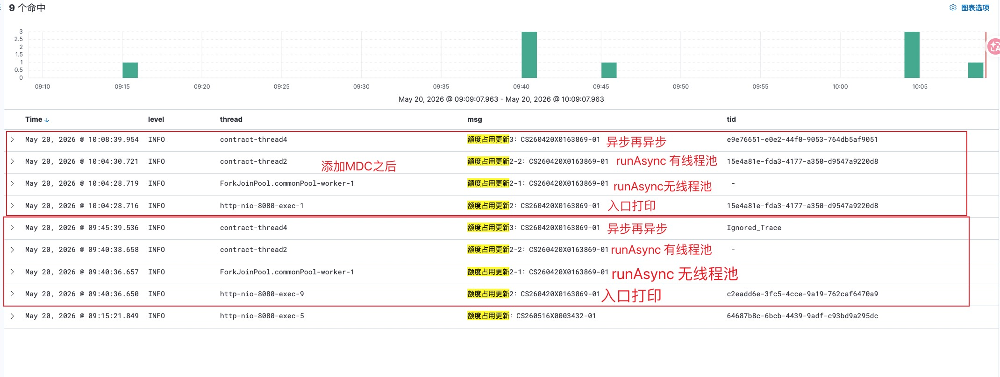
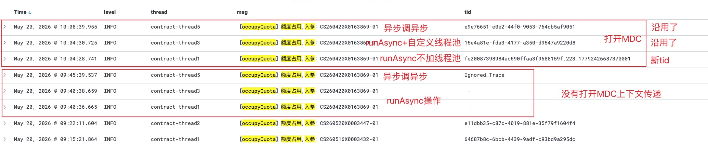

# 异步方法丢失链路追踪问题解决

这篇文章记录一次在合同服务里排查异步方法丢失链路追踪 `tid` 的过程。问题本身不复杂，但里面混合了三种异步方式：

- Spring `@Async`
- `CompletableFuture.runAsync`
- 自定义 `ThreadPoolTaskExecutor`

真正容易混淆的点是：**不是所有异步都会自动继承请求线程里的链路上下文，只有被链路追踪组件或线程池包装过的线程切换点，才有机会继续携带原来的 `tid`。**

## 场景

合同服务里有一个额度占用更新接口：

```java
@Override
@ApiOperation("未实提/月交易/欠款期票额度占用")
@PutMapping("/purchase/quota/handleQuota/{contractCode}")
public void handleQuota(@PathVariable String contractCode) {
    log.info("额度占用更新：{}", contractCode);
    memberQuotaManager.handleQuota(contractCode);
}
```

`memberQuotaManager.handleQuota` 方法本身标注了 `@Async`：

```java
@Override
@Async
public void handleQuota(String contractCode) {
    log.info("【occupyQuota】额度占用,入参：{}", contractCode);
    // 查询采购合同并处理额度占用
}
```

项目里配置了 Spring 异步线程池：

```java
@Bean(name = "taskExecutor")
public TaskExecutor taskExecutor() {
    ThreadPoolTaskExecutor executor = new ThreadPoolTaskExecutor();
    executor.setCorePoolSize(20);
    executor.setMaxPoolSize(100);
    executor.setQueueCapacity(200);
    executor.setKeepAliveSeconds(120);
    executor.setThreadNamePrefix("contract-thread");
    executor.setRejectedExecutionHandler(new ThreadPoolExecutor.CallerRunsPolicy());
    return executor;
}
```

为了验证异步场景下 `tid` 是否还能传递，我临时加了两个测试接口。

第一个接口里混合了两种 `CompletableFuture.runAsync`：

```java
@ApiOperation("测试异步接口")
@PutMapping("/purchase/quota/handleQuota2/{contractCode}")
public void handleQuota2(@PathVariable String contractCode) {
    log.info("额度占用更新2：{}", contractCode);

    CompletableFuture.runAsync(() -> {
        log.info("额度占用更新2-1：{}", contractCode);
        memberQuotaManager.handleQuota(contractCode);
    });

    try {
        Thread.sleep(2000);
    } catch (InterruptedException e) {
        throw new RuntimeException(e);
    }

    CompletableFuture.runAsync(() -> {
        log.info("额度占用更新2-2：{}", contractCode);
        memberQuotaManager.handleQuota(contractCode);
    }, taskExecutor);
}
```

第二个接口是异步方法里再调用异步方法：

```java
@ApiOperation("测试异步接口-异步再异步")
@PutMapping("/purchase/quota/handleQuota3/{contractCode}")
@Async
public void handleQuota3(@PathVariable String contractCode) {
    log.info("额度占用更新3：{}", contractCode);
    memberQuotaManager.handleQuota(contractCode);
}
```

## 当时的解决方式

第一次测试时，发现部分异步日志没有 `tid`，或者进入内部 `@Async` 后显示 `Ignored_Trace`。

后来我在 `ThreadPoolConfig` 里打开了 `TaskDecorator`，把提交任务时的 MDC 上下文复制到执行任务的线程里，并使用 SkyWalking 的 `RunnableWrapper` 包装任务：

```java
executor.setTaskDecorator(r -> {
    Map<String, String> copyOfContextMap = MDC.getCopyOfContextMap();
    log.info("taskExecutor capture, thread={}, mdc={}, skyTraceId={}",
            Thread.currentThread().getName(), copyOfContextMap, TraceContext.traceId());

    Runnable decorated = () -> {
        Map<String, String> oldMdc = MDC.getCopyOfContextMap();
        if (copyOfContextMap != null) {
            MDC.setContextMap(copyOfContextMap);
        } else {
            MDC.clear();
        }

        try {
            log.info("taskExecutor before run, thread={}, mdc={}, skyTraceId={}",
                    Thread.currentThread().getName(), MDC.getCopyOfContextMap(), TraceContext.traceId());
            r.run();
        } finally {
            if (oldMdc != null) {
                MDC.setContextMap(oldMdc);
            } else {
                MDC.clear();
            }
        }
    };

    return RunnableWrapper.of(decorated);
});
```

打开后，现象变成了下面这样。





### 开启 MDC 传递前后对比

这次测试最重要的结论，是要区分“原来哪些场景不生效”和“打开 `TaskDecorator + RunnableWrapper` 后哪些场景生效”。

开启前的表现：

| 场景 | 线程变化 | tid 表现 | 是否生效 |
| --- | --- | --- | --- |
| HTTP 直接调用 `handleQuota`，内部调用 `memberQuotaManager.handleQuota @Async` | `http-nio` -> `contract-thread*` | 和入口 tid 一致 | 生效 |
| HTTP 直接进入 `handleQuota2` 入口 | `http-nio-8080-exec-*` | 有入口 tid | 生效 |
| 裸 `CompletableFuture.runAsync` | `http-nio` -> `ForkJoinPool.commonPool-worker-*` | `tid = -` | 不生效 |
| 裸 `runAsync` 里再调用 `memberQuotaManager.handleQuota` | `ForkJoinPool` -> `contract-thread*` | `tid = -` 或 `Ignored_Trace` | 不稳定，不算生效 |
| `CompletableFuture.runAsync(..., taskExecutor)` | `http-nio` -> `contract-thread*` | `tid = -` | 不生效 |
| `handleQuota3 @Async` 再调用 `memberQuotaManager.handleQuota @Async` | `contract-thread*` -> `contract-thread*` | 可能出现 `Ignored_Trace` | 不生效 |

开启后的表现：

| 场景 | 线程变化 | tid 表现 | 是否生效 |
| --- | --- | --- | --- |
| HTTP 直接调用 `handleQuota`，内部调用 `memberQuotaManager.handleQuota @Async` | `http-nio` -> `contract-thread*` | 和入口 tid 一致 | 生效 |
| HTTP 直接进入 `handleQuota2` 入口 | `http-nio-8080-exec-*` | 有入口 tid | 生效 |
| 裸 `CompletableFuture.runAsync` | `http-nio` -> `ForkJoinPool.commonPool-worker-*` | `tid = -` | 仍然不生效 |
| 裸 `runAsync` 里再调用 `memberQuotaManager.handleQuota` | `ForkJoinPool` -> `contract-thread*` | 生成新 tid，和入口 tid 不同 | 不是传递成功，是断链后新建 trace |
| `CompletableFuture.runAsync(..., taskExecutor)` | `http-nio` -> `contract-thread*` | 和入口 tid 一致 | 生效 |
| `runAsync(..., taskExecutor)` 里再调用 `memberQuotaManager.handleQuota @Async` | `contract-thread*` -> `contract-thread*` | 和入口 tid 一致 | 生效 |
| `handleQuota3 @Async` 再调用 `memberQuotaManager.handleQuota @Async` | `contract-thread*` -> `contract-thread*` | 两次异步 tid 一致 | 生效 |

所以打开 MDC 传递后，并不是所有异步场景都会自动恢复。它只保证**经过这个 `taskExecutor` 的任务**可以复制 MDC，并通过 `RunnableWrapper` 继续携带 SkyWalking trace。

仍然不生效的核心场景是：

```text
没有经过自定义 taskExecutor 的线程切换。
```

最典型的就是裸 `CompletableFuture.runAsync()`，因为它默认使用 `ForkJoinPool.commonPool`。

从日志里可以看到几组典型结果。

### 1. 入口日志有 tid

HTTP 请求直接进入 controller，请求线程是 `http-nio-8080-exec-*`，入口日志能拿到当前请求的链路 `tid`：

| 日志位置 | 线程 | tid |
| --- | --- | --- |
| `额度占用更新2` | `http-nio-8080-exec-1` | `15e4a81e-fda3-4177-a350-d9547a9220d8` |

这说明请求入口本身没有问题，链路追踪已经在 HTTP 请求线程里建立好了上下文。

### 2. 一开始 `@Async` 能拿到 tid，说明了什么

一开始直接调用 `handleQuota` 时，controller 入口日志有 tid，进入 `memberQuotaManager.handleQuota` 这个 `@Async` 方法后仍然有同一个 tid。

这个现象很关键，它说明：

```text
Spring @Async 这条异步链路本身已经被某个机制做过 trace 上下文传播。
```

因为 `tid` 这类链路信息本质上依赖当前线程上下文，常见实现就是 `ThreadLocal`。如果从 `http-nio` 请求线程切到 `contract-thread` 线程后还能打印出同一个 tid，就说明中间一定发生过“捕获父线程上下文 -> 包装异步任务 -> 子线程执行时恢复上下文”的动作。

这个动作不是因为我创建了什么 SkyWalking 专用线程。我的线程池只是普通的 Spring `ThreadPoolTaskExecutor`：

```text
http-nio 请求线程
    ↓ 提交 @Async 任务
contract-thread 业务线程
```

它能生效，通常是因为 SkyWalking Java Agent 在运行期通过插件和字节码增强拦截了相关框架边界，例如 HTTP 入口、Spring 异步调用、线程池任务提交或任务执行过程。它关注的不是线程名字，也不是线程是不是“SkyWalking 类型”，而是任务从一个线程提交到另一个线程时，能不能把当前 trace 上下文包装到 `Runnable` / `Callable` 里。

后来确认 SkyWalking Agent 里确实存在对 Spring `@Async` 的增强插件：

```text
spring-async-annotation-5.x
```

这个插件非常关键。它说明最开始直接调用 `handleQuota` 时，内部 `memberQuotaManager.handleQuota @Async` 能拿到同一个 tid，不是偶然，也不是 ThreadLocal 自己跨线程了，而是 SkyWalking Agent 对 Spring 5.x 的异步注解调用链路做了自动增强。

官方插件列表里可以看到这个插件名：

- [SkyWalking Java Agent Plugin List](https://skywalking.apache.org/docs/skywalking-java/latest/en/setup/service-agent/java-agent/plugin-list/)

对应的插件 artifact 可以参考：

- [Maven Central: org.apache.skywalking:apm-spring-async-annotation-plugin](https://central.sonatype.com/artifact/org.apache.skywalking/apm-spring-async-annotation-plugin)

所以这条路径的真实解释应该是：

```text
HTTP 请求线程中已有 trace 上下文
    ↓
调用 Spring @Async 方法
    ↓
spring-async-annotation-5.x 插件增强 @Async 异步提交过程
    ↓
异步线程 contract-thread 执行业务方法时恢复 trace 上下文
    ↓
内部日志打印出和入口一致的 tid
```

所以初始现象不能理解成“ThreadLocal 天然能跨线程”。更准确的表达是：

```text
ThreadLocal 不能天然跨线程；
直接 @Async 能拿到 tid，是因为链路追踪组件已经对这条异步路径做了自动增强。
```

### 3. 裸 `runAsync` 没有 tid

第一段 `CompletableFuture.runAsync` 没有传线程池：

```java
CompletableFuture.runAsync(() -> {
    log.info("额度占用更新2-1：{}", contractCode);
    memberQuotaManager.handleQuota(contractCode);
});
```

它默认走 JDK 的 `ForkJoinPool.commonPool`，不是 Spring 的 `taskExecutor`。

所以日志变成：

| 日志位置 | 线程 | tid |
| --- | --- | --- |
| `额度占用更新2-1` | `ForkJoinPool.commonPool-worker-1` | `-` |

这说明 `ThreadPoolConfig` 里的 `TaskDecorator` 没有机会生效，因为这个任务根本没有提交到自定义线程池。

### 4. 裸 `runAsync` 里再调用 `@Async`，生成了一个新 tid

比较容易误解的是这一段：

```java
CompletableFuture.runAsync(() -> {
    log.info("额度占用更新2-1：{}", contractCode);
    memberQuotaManager.handleQuota(contractCode);
});
```

`runAsync` 这一层没有 tid，但是进入 `memberQuotaManager.handleQuota` 后，日志里又出现了一个新的 tid：

| 日志位置 | 线程 | tid |
| --- | --- | --- |
| `额度占用更新2-1` | `ForkJoinPool.commonPool-worker-1` | `-` |
| `【occupyQuota】额度占用` | `contract-thread1` | `fe20087398984ac690ffaa3f9688159f.223.17792426687370001` |

这个新 tid 不是从入口请求复制过来的。

真正的链路是：

```text
HTTP 请求线程有入口 tid
        ↓
裸 CompletableFuture.runAsync 进入 ForkJoinPool，父 trace 丢失
        ↓
在 ForkJoinPool 里调用 memberQuotaManager.handleQuota
        ↓
Spring @Async 再提交到 taskExecutor
        ↓
此时已经没有父 trace，只能生成新的 trace
```

也就是说，这个新 tid 的含义是：

```text
链路已经断了，后面的 @Async 执行被当成新的 trace root 记录。
```

它不是“传递成功”，而是“断链后重新开始”。

### 5. `runAsync + 自定义线程池` 可以沿用入口 tid

第二段 `CompletableFuture.runAsync` 显式传入了 `taskExecutor`：

```java
CompletableFuture.runAsync(() -> {
    log.info("额度占用更新2-2：{}", contractCode);
    memberQuotaManager.handleQuota(contractCode);
}, taskExecutor);
```

这次任务提交时还在 HTTP 请求线程里，`TaskDecorator` 能捕获入口线程的 MDC 和 trace 信息。

所以日志表现为：

| 日志位置 | 线程 | tid |
| --- | --- | --- |
| `额度占用更新2` | `http-nio-8080-exec-1` | `15e4a81e-fda3-4177-a350-d9547a9220d8` |
| `额度占用更新2-2` | `contract-thread2` | `15e4a81e-fda3-4177-a350-d9547a9220d8` |
| `【occupyQuota】额度占用` | `contract-thread3` | `15e4a81e-fda3-4177-a350-d9547a9220d8` |

虽然线程名从 `http-nio` 变成了 `contract-thread2`，再变成 `contract-thread3`，但 `tid` 一直相同。

这说明自定义线程池的上下文传递已经生效。

### 6. 异步方法里再调用异步方法，也能沿用 tid

`handleQuota3` 自己标注了 `@Async`：

```java
@Async
public void handleQuota3(@PathVariable String contractCode) {
    log.info("额度占用更新3：{}", contractCode);
    memberQuotaManager.handleQuota(contractCode);
}
```

它的入口线程已经是 `contract-thread4`，说明第一跳 `@Async` 生效了。后面再调用 `memberQuotaManager.handleQuota`，线程又变成 `contract-thread5`。

但两个日志里的 tid 是一致的：

| 日志位置 | 线程 | tid |
| --- | --- | --- |
| `额度占用更新3` | `contract-thread4` | `e9e76651-e0e2-44f0-9053-764db5af9051` |
| `【occupyQuota】额度占用` | `contract-thread5` | `e9e76651-e0e2-44f0-9053-764db5af9051` |

这说明第一跳 `@Async` 已经把请求入口的上下文带到了 `contract-thread4`，第二跳提交任务时，`contract-thread4` 里仍然有上下文，所以还能继续传给 `contract-thread5`。

## 关键原理

### MDC 不是链路追踪本身

MDC 是日志框架提供的线程上下文容器，通常底层是 `ThreadLocal`。

它可以让日志打印出当前线程里的上下文字段，比如：

- `tid`
- `traceId`
- `requestId`
- `userId`
- `tenantId`

但 MDC 有一个天然限制：

```text
ThreadLocal 只属于当前线程，线程切换后不会自动复制。
```

所以只要发生异步、线程池、回调、MQ 消费、定时任务等线程切换，就要考虑上下文传播。

### 为什么普通线程池也可能自动传递 tid

我一开始的疑问是：

```text
我的线程池只是 ThreadPoolTaskExecutor，又没有按 SkyWalking 的线程类型创建，为什么 @Async 还是能拿到 tid？
```

原因是 SkyWalking 这类 Java Agent 通常不是通过“创建特殊线程”来传播上下文，而是通过运行期增强来拦截关键调用点。

可以把它理解成：

```text
提交异步任务时：
    从当前线程读取 trace 上下文
    把上下文包进 Runnable / Callable

执行异步任务时：
    从包装对象里取出 trace 上下文
    放回当前执行线程
    执行业务代码
    执行完成后清理上下文
```

所以线程池本身仍然是普通线程池，线程名也只是 `contract-thread*`。真正决定 tid 能不能传过去的，是“任务提交和任务执行这个边界有没有被增强或手工包装”。

这也解释了为什么不同异步方式表现不一样：

| 异步方式 | 初始表现 | 原因 |
| --- | --- | --- |
| HTTP 入口直接调用 `@Async` 方法 | 能拿到入口 tid | `spring-async-annotation-5.x` 插件增强了 Spring `@Async` 链路 |
| 裸 `CompletableFuture.runAsync()` | 拿不到入口 tid | 默认走 `ForkJoinPool.commonPool`，没有经过项目自定义包装 |
| `CompletableFuture.runAsync(..., taskExecutor)` 开启包装前 | 拿不到入口 tid | 虽然用了同一个线程池，但这条提交路径没有被当前自动增强稳定覆盖 |
| `CompletableFuture.runAsync(..., taskExecutor)` 开启包装后 | 能拿到入口 tid | `TaskDecorator + RunnableWrapper` 在提交到 `taskExecutor` 时手工补上了上下文传播 |

### TaskDecorator 解决的是“提交到这个线程池”的任务

`ThreadPoolTaskExecutor#setTaskDecorator` 的作用点是：

```text
任务提交到这个 executor 时，先包装 Runnable，再交给线程池执行。
```

因此它能覆盖：

| 场景 | 是否能覆盖 | 原因 |
| --- | --- | --- |
| `@Async` 默认使用 `taskExecutor` | 能 | Spring 异步任务提交到了这个 executor |
| `CompletableFuture.runAsync(..., taskExecutor)` | 能 | 显式提交到了这个 executor |
| `taskExecutor.execute(...)` | 能 | 直接使用了这个 executor |
| 裸 `CompletableFuture.runAsync(...)` | 不能 | 默认走 `ForkJoinPool.commonPool` |
| `new Thread(...)` | 不能 | 没有经过这个 executor |
| 其他业务自建线程池 | 不能 | 除非也配置同类包装 |
| 第三方异步回调线程 | 不一定 | 取决于第三方线程是否支持包装或链路追踪 agent 是否增强 |

所以这次现象里，`runAsync + 自定义线程池` 可以携带入口 tid，而裸 `runAsync` 不行。

### RunnableWrapper 解决的是 SkyWalking trace 传播

只复制 MDC，通常只能保证日志框架里的字段被复制过去。

但 SkyWalking 的 trace 上下文不一定完全等价于 MDC。项目里使用：

```java
return RunnableWrapper.of(decorated);
```

这一步是为了让 SkyWalking 在异步任务执行时还能关联原来的 trace。

可以把它理解为两层：

```text
MDC.setContextMap(...)       -> 让日志线程上下文字段能延续
RunnableWrapper.of(...)      -> 让 SkyWalking trace 上下文能延续
```

如果只做 MDC 复制，日志里某些字段可能看起来有了，但链路追踪系统里的调用关系未必完整。

### 为什么会出现新 tid

出现新 tid 的根本原因是：

```text
父 trace 已经在某一次线程切换时丢失，后续异步执行又被链路追踪组件识别成一段可追踪任务，于是创建了新的 trace。
```

它不是原链路继续传播，而是断链后的重新开始。

用这次日志对应起来：

```text
入口 tid: 15e4a81e-fda3-4177-a350-d9547a9220d8
        ↓
ForkJoinPool 线程: tid = -
        ↓
内部 @Async: tid = fe20087398984ac690ffaa3f9688159f.223.17792426687370001
```

这里的 `fe200...` 和 `15e4...` 不同，说明它已经不是同一条链路。

## 更多思考

### 1. 以后不要裸用 `CompletableFuture.runAsync`

如果业务代码里需要异步执行，尽量统一写成：

```java
CompletableFuture.runAsync(() -> {
    // business code
}, taskExecutor);
```

不要写：

```java
CompletableFuture.runAsync(() -> {
    // business code
});
```

原因有三个：

- 默认 `ForkJoinPool.commonPool` 不受项目线程池参数控制。
- 不走 `TaskDecorator`，MDC 和 trace 容易丢。
- 公共线程池被阻塞后，可能影响同 JVM 内其他依赖 common pool 的任务。

### 2. 异步线程池最好统一命名和统一封装

这次能排查出来，很大原因是线程名前缀清楚：

```text
http-nio-8080-exec-1
ForkJoinPool.commonPool-worker-1
contract-thread2
contract-thread3
```

线程名能帮助判断任务到底跑在哪个线程池里。

实际项目里可以约定：

- Spring `@Async` 使用统一的 `taskExecutor`。
- 业务自定义线程池必须配置线程名前缀。
- 业务自定义线程池必须配置上下文传播包装。
- 禁止在核心业务链路里直接使用裸 `new Thread` 和裸 `CompletableFuture.runAsync`。

### 3. `@Async` 还有代理失效问题

这次 `memberQuotaManager.handleQuota` 是通过 Spring Bean 调用的，所以 `@Async` 生效。

但如果是同一个类内部直接调用自己的 `@Async` 方法，例如：

```java
this.asyncMethod();
```

这种调用不会经过 Spring 代理，`@Async` 可能不会生效。

所以排查异步问题时，不仅要看方法上有没有 `@Async`，还要看调用方式是不是经过了 Spring 代理。

### 4. `Ignored_Trace` 和空 tid 不完全一样

空 tid 通常表示当前日志线程里没有可用 trace 信息。

`Ignored_Trace` 更像是链路追踪组件明确判断当前上下文不参与追踪，或者当前片段处于被忽略的 trace 状态。

两者都说明当前日志无法和入口请求稳定关联，但含义略有不同：

| 表现 | 大致含义 |
| --- | --- |
| `tid = -` | 当前线程没有 trace/MDC 字段 |
| `tid = Ignored_Trace` | 当前 trace 被追踪组件标记为忽略 |
| `tid = 新值` | 当前线程新建了一条 trace |
| `tid = 入口值` | 上下文传播成功 |

排查时不要只看有没有 `tid`，还要看这个 `tid` 是否和入口请求一致。

### 5. 线程池包装要注意清理旧 MDC

线程池里的线程会复用，如果只设置 MDC，不在 finally 里清理或恢复，就可能出现日志串号。

所以包装逻辑里要保留旧 MDC，并在任务结束后恢复：

```java
Map<String, String> oldMdc = MDC.getCopyOfContextMap();
try {
    MDC.setContextMap(copyOfContextMap);
    r.run();
} finally {
    if (oldMdc != null) {
        MDC.setContextMap(oldMdc);
    } else {
        MDC.clear();
    }
}
```

这一点很重要。否则 A 请求的 `tid` 可能残留在线程里，被 B 请求的日志误用。

## 最终结论

这次问题的核心不是 `@Async` 一定丢链路，也不是 `CompletableFuture` 一定丢链路，而是：

```text
每一次线程切换，都要看任务有没有经过支持上下文传播的包装。
```

可以总结成几条：

- HTTP 请求入口有 `tid`，说明入口链路正常。
- `@Async` 如果使用配置过 `TaskDecorator + RunnableWrapper` 的 `taskExecutor`，可以继续携带入口 `tid`。
- `CompletableFuture.runAsync(..., taskExecutor)` 可以被自定义线程池包装，所以能沿用入口 `tid`。
- 裸 `CompletableFuture.runAsync()` 默认走 `ForkJoinPool.commonPool`，不走项目自定义线程池，容易丢失 `tid`。
- 裸 `runAsync` 丢失父 trace 后，再进入内部 `@Async` 出现的新 `tid`，不是传播成功，而是断链后重新创建了一条 trace。
- 以后核心业务链路里的异步任务要统一使用项目配置过上下文传播的线程池。

我自己以后看到类似问题，会优先按这个顺序排查：

```text
入口有没有 tid
    ↓
每一次线程切换跑在哪个线程池
    ↓
这个线程池有没有上下文传播包装
    ↓
异步方法调用是否经过 Spring 代理
    ↓
内部日志的 tid 是否和入口 tid 一致
```

只要把线程切换点一层一层画出来，异步丢链路的问题就会清楚很多。
