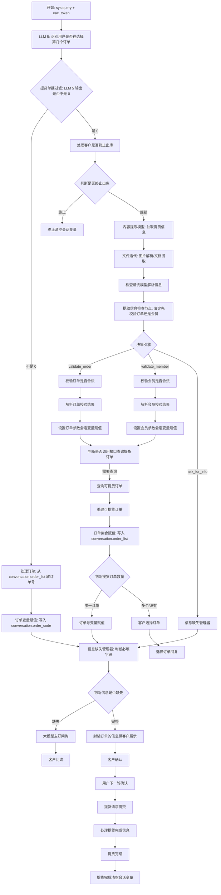
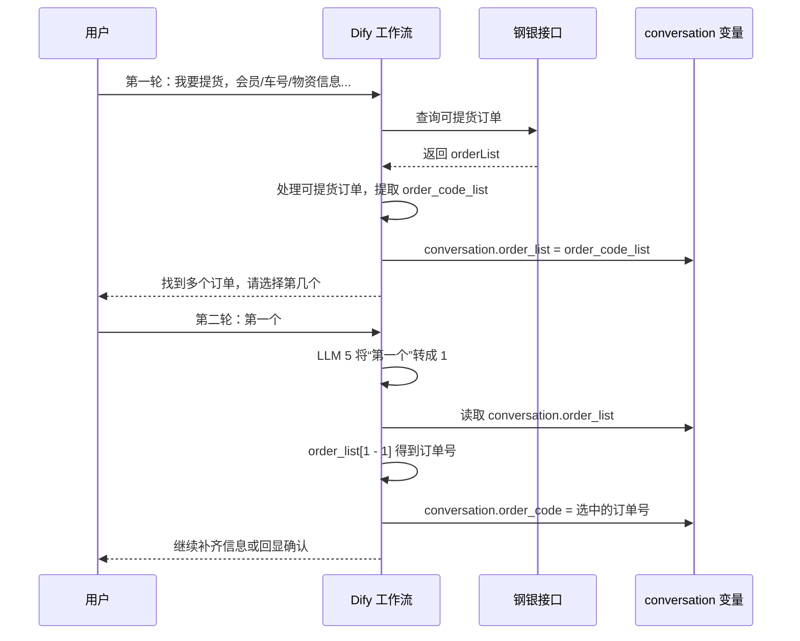

# 钢银提货助手 Dify 流程地图

> 来源 DSL：`/Users/ddd/Downloads/钢银提货助手4Phone-V2.yml`
>
> 应用名称：钢银提货助手4Phone-V2
>
> 应用模式：advanced-chat

这份流程地图不是按 Dify 画布坐标阅读，而是按“业务阶段、会话变量、接口调用、模型职责”来还原。这个工作流本质上是一个多轮对话状态机：用户每一轮输入都会重新从开始节点进入，但会通过 `conversation_id` 继承同一个会话里的 `conversation.*` 变量。

## 一、整体结论

这个 Dify 工作流主要完成一件事：帮助客户从自然语言、图片或文档中整理提货信息，校验订单/会员，查询可提货订单，补齐提货方式对应的必填字段，最后提交提货申请。

核心不是单纯“调用大模型”，而是下面几类能力的组合：

| 能力 | 对应节点类型 | 作用 |
| --- | --- | --- |
| 信息理解 | `llm` | 从用户输入中抽取订单号、会员、提货方式、车船号、身份证、手机号、物资明细等 |
| 流程路由 | `if-else` | 判断是校验订单、校验会员、追问缺失字段、选择订单、确认提交还是终止 |
| 业务规则 | `code` | 格式判断、字段清洗、订单列表处理、提货信息组装 |
| 接口调用 | `http-request` / `code` | 调用订单校验、会员校验、可提货订单查询、提货申请提交接口 |
| 会话记忆 | `assigner` | 把业务状态写入 `conversation.*`，支持多轮对话 |
| 用户回复 | `answer` | 输出追问、订单选择、确认回显、提交成功等话术 |

## 二、节点规模

| 节点类型 | 数量 | 阅读重点 |
| --- | ---: | --- |
| `if-else` | 20 | 看条件变量和分支含义 |
| `assigner` | 18 | 看写入了哪个 `conversation.*` |
| `code` | 15 | 看隐藏业务规则 |
| `answer` | 6 | 看用户最终看到什么 |
| `llm` | 5 | 看提示词、模型、输出格式 |
| `http-request` | 4 | 看调用了哪些业务接口 |
| `start` | 1 | 看外部传入参数 |
| `iteration` / `iteration-start` | 2 | 处理上传文件列表 |
| `document-extractor` | 1 | 文档文本提取 |
| `variable-aggregator` | 1 | 聚合图片/文档解析结果 |

## 三、主流程地图



## 四、多轮对话状态图

这个工作流最容易看晕的地方是：后面的节点写入了会话变量，前面的节点在下一轮又读取它。比如 `conversation.order_list` 就是典型例子。



## 五、关键会话变量

| 会话变量 | 初始值 | 主要写入节点 | 主要读取场景 | 业务含义 |
| --- | --- | --- | --- | --- |
| `conversation.order_list` | `[]` | `订单集合赋值` | `处理订单` | 多订单场景下保存可选订单号列表，供下一轮“第一个/第二个”使用 |
| `conversation.order_code` | `""` | `设置订单参数会话变量赋值`、`订单号变量赋值`、`订单变量赋值`、`订单号赋值` | 校验订单、查询订单、提货申请提交、回显 | 当前选中的订单号 |
| `conversation.company_name` | `""` | `设置订单参数会话变量赋值`、`设置会员参数会话变量赋值` | 缺失字段判断、接口查询、回显 | 会员名称 |
| `conversation.member_id` | `""` | `设置订单参数会话变量赋值`、`设置会员参数会话变量赋值` | 查询可提货订单、提交提货申请 | 会员 ID |
| `conversation.delivery_type` | `""` | `提货类型赋值` | 缺失字段判断、回显、提交提货申请 | 提货方式，内部值包括 `DIRECT`、`VEHICLE`、`IDENTITY` |
| `conversation.order_items` | `[]` | `设置订单参数会话变量赋值` | 回显、提交提货申请 | 订单资源明细 |
| `conversation.transportInfos` | `[]` | `提货车船信息赋值` | 提交提货申请 | 车船/司机/身份证/手机号等运输信息 |
| `conversation.receiving_company` | `""` | `提货公司变量赋值` | 直接过户场景、提交提货申请 | 提货公司/接货公司 |
| `conversation.is_complete` | `0` | `信息收集完成变量赋值1/2` | 判断是否进入确认/提交 | 信息是否已经收集完整 |

### `order_list` 来源

`conversation.order_list` 不是外部天然传入的字段，而是在工作流内部写入：

```text
查询可提货订单
→ 处理可提货订单
→ 订单集合赋值
→ conversation.order_list
```

对应 DSL 逻辑：

```yaml
title: 订单集合赋值
type: assigner
value:
  - '1772022886036'
  - order_code_list
variable_selector:
  - conversation
  - order_list
operation: over-write
```

其中 `1772022886036` 是 `处理可提货订单` 节点，它从接口返回 `orderList` 里提取 `orderCode`，得到 `order_code_list`。

## 六、LLM 节点地图

| 节点标题 | 模型 | 温度 | 主要职责 | 输出用途 |
| --- | --- | ---: | --- | --- |
| `内容提取模型` | `qwen3-max-preview` | `0` | 从用户文本和文件解析结果中抽取订单号、会员、提货方式、车船号、身份证、手机号、提货公司、物资明细 | 后续清洗、校验、缺失字段判断 |
| `图片解析模型` | `qwen-vl-plus-latest` | 未显式配置 | 从图片中解析文字或单据信息 | 汇总给内容提取模型 |
| `大模型友好问询` | `qwen3-max` | `0.7` | 根据缺失字段生成自然追问 | `客户问询` answer 节点 |
| `客户选择订单` | `qwen3-max` | `0.7` | 根据订单数量和订单列表，引导用户选择订单 | `选择订单回复` answer 节点 |
| `LLM 5` | `qwen3-max` | `0.7` | 把“第一个/第二个/No.3”等自然语言选择转成数字；识别不到输出 `0` | `提货单据过滤` if-else 判断 |

### 关于 `LLM 5`

`LLM 5` 是理解“用户是否在选择订单”的关键节点。它不是抽取提货单据内容，而是一个顺序选择转换器：

```text
第一个 → 1
第二个 → 2
无法识别序号 → 0
```

紧随其后的 `提货单据过滤` 判断：

```text
LLM 5.text != "0"
```

如果不是 `0`，进入 `处理订单`，从 `conversation.order_list` 按下标取出订单号。

## 七、接口调用地图

| 节点标题 | 方法 | URL | 入参来源 | 出参用途 |
| --- | --- | --- | --- | --- |
| `校验订单是否合法` | `POST` | `/gateway/banksteel-delivery/api/v1/delivery/sales/query/ai/delivery` | `orderCode` 来自抽取/清洗后的订单号 | 解析会员、订单、资源明细，并写入会话变量 |
| `校验会员是否合法` | `GET` | `/gateway/banksteel-member-new/api/v1/member/member/findMembersBySubName` | `subName` 来自抽取出的会员名称 | 解析 `memberId`、会员名称 |
| `查询可提货订单` | `POST` | `/gateway/banksteel-delivery/api/v1/delivery/sales/query/ai/delivery` | `memberId`、`memberName`、`orderCode`、`applyItemStrList` | 返回可提货订单列表 |
| `校验订单是否合法 (1)` | `POST` | `/gateway/banksteel-delivery/api/v1/delivery/sales/query/ai/delivery` | `conversation.order_code` | 重新校验订单并刷新订单会话变量 |
| `提货请求提交` | `POST` | `/gateway/banksteel-delivery/api/v1/delivery/buy/web/ai/delivery/apply` | `order_code`、`delivery_type`、`order_items`、`transportInfos`、`member_id`、`company_name`、`receiving_company` | 创建提货申请 |

所有 HTTP 节点都依赖开始节点传入的：

```text
Eac-Session-Id: {{#1770095828348.eac_token#}}
```

## 八、业务规则地图

### 1. 订单优先还是会员优先

`提取信息检查节点` 会判断：

```text
如果 order_code 存在，并且长度 >= 6，且以 CS 或 YS 开头
→ flow_type = order_first
→ next_action = validate_order

否则如果 member_name 存在
→ flow_type = member_first
→ next_action = validate_member

否则
→ next_action = ask_for_info
```

这说明当前实现把订单号作为更强的业务锚点。

### 2. 必填字段

基础必填字段：

```text
company_name
order_code
delivery_type
```

根据提货方式追加：

```text
DIRECT   → receiving_company
VEHICLE  → vehicles
IDENTITY → identities
```

### 3. 提货方式映射

内容提取模型输出的是中文：

```text
直接过户
凭车船号提货
凭身份证提货
```

清洗节点转换成内部枚举：

```text
直接过户     → DIRECT
凭车船号提货 → VEHICLE
凭身份证提货 → IDENTITY
```

### 4. 多订单选择

当可提货订单数量不是唯一时：

```text
处理可提货订单
→ 提取 order_code_list
→ 订单集合赋值写入 conversation.order_list
→ 客户选择订单生成回复
```

下一轮用户说“第一个/第二个”时：

```text
LLM 5 输出数字
→ 提货单据过滤判断不是 0
→ 处理订单执行 order_list[order_num - 1]
→ 写入 conversation.order_code
```

## 九、用户回复来源

| 回复场景 | answer 节点 | 上游来源 |
| --- | --- | --- |
| 缺失字段追问 | `客户问询` | `大模型友好问询.text` |
| 多订单选择提示 | `选择订单回复` | `客户选择订单.text` |
| 提货信息回显确认 | `客户确认` | `封装订单的信息供客户展示.markdown` |
| 确认信息再次回显 | `响应客户确认信息` | `提货信息再次回显.markdown` |
| 提货成功 | `提货完结` | `处理提货完成信息.markdown` |
| 终止提货 | `终止提货` | 固定话术 |

## 十、建议的 Debug 阅读顺序

不要从画布左边一路拖到右边。建议按下面顺序看：

1. 先跑一轮“我要提货”，看 `内容提取模型` 输出了哪些结构化字段。
2. 看 `检查清洗模型解析信息`，确认中文提货方式是否转成内部枚举。
3. 看 `提取信息检查节点`，确认走订单校验、会员校验还是追问。
4. 看 `信息缺失管理器`，确认缺失字段列表。
5. 看 `大模型友好问询`，确认用户看到的追问为什么这么生成。
6. 构造能查出多个订单的输入，看 `查询可提货订单` 和 `处理可提货订单`。
7. 看 `订单集合赋值` 是否写入 `conversation.order_list`。
8. 下一轮输入“第一个”，看 `LLM 5` 是否输出 `1`。
9. 看 `处理订单` 是否从 `conversation.order_list` 中取到正确订单号。
10. 补齐字段后看 `封装订单的信息供客户展示` 和 `提货请求提交`。

## 十一、疑点与风险点

| 风险点 | 说明 | 建议排查 |
| --- | --- | --- |
| 模型供应链不透明 | DSL 显示 provider 是 `gangyin/tongyi/tongyi`，模型名是 Qwen 系列；看不到是否封装了自研意图识别模型 | 查看 Dify 模型供应商配置、插件源码或网关日志 |
| `提货单据过滤` 命名误导 | 实际作用是判断用户是否在选择订单，不是过滤提货单据 | 可以在流程图中改名为“订单选择识别” |
| `conversation.order_list` 跨轮依赖强 | 如果调用方没有带同一个 `conversation_id`，下一轮“第一个”会取不到订单列表 | 检查调用方是否复用 `conversation_id` |
| `order_list` 类型标注不一致 | 顶部定义是 `array[string]`，部分节点变量标注成 `array[object]` | 统一成订单号字符串数组，或改成完整订单对象 |
| `LLM 5` 输出格式依赖大模型稳定性 | 期望只输出纯数字；如果输出“1。”或“第1个”，Python 转换可能异常 | 增加 code 节点兜底清洗 |
| 接口鉴权显示 `no-auth` | HTTP 节点配置是 no-auth，但实际依赖 `Eac-Session-Id` 请求头 | 文档里明确这是业务会话鉴权 |
| 提交提货申请代码关闭 SSL 校验 | `requests.post(..., verify=False)` | 确认证书问题，生产环境不建议关闭校验 |
| 会话清空不包含 `order_list` | 终止/完成清空节点清理了很多变量，但当前清单里没有看到清空 `conversation.order_list` | Debug 验证完成/终止后 `order_list` 是否残留 |

## 十二、如何把它讲成业务需求

可以把当前实现反推成下面这份需求摘要：

```text
作为提货客户，
我可以用自然语言、图片或文档发起提货，
系统需要自动识别会员、订单、提货方式、车船/身份/接货公司等信息。

当订单或会员信息不足时，
系统需要自然追问关键缺失字段。

当查询到多个可提货订单时，
系统需要展示订单列表并允许用户按“第几个”选择。

当信息完整后，
系统需要回显提货信息并等待用户确认。

用户确认后，
系统调用提货申请接口创建提货单，
并在完成或终止后清理会话状态。
```

这就是这份 Dify 工作流背后的业务骨架。
